# IWMS - Sơ Đồ Thực Thể Quan Hệ (Entity Relationship Diagram - ERD)

Tài liệu thiết kế cơ sở dữ liệu chi tiết cho hệ thống **Inventory & Warehouse Management System (IWMS)**.
Cơ sở dữ liệu được xây dựng trên **PostgreSQL 16+**, tuân thủ nguyên tắc **Ledger-First Architecture** với sổ cái bất biến (Append-Only) và bộ đệm số dư trực tiếp (Live Balance Cache).

---

## 1. Sơ Đồ Tổng Thể (Mermaid ERD)

```mermaid
erDiagram
    users {
        bigserial id PK
        text email UK
        text password_hash
        text full_name
        text role "ADMIN, MANAGER, STAFF, AUDITOR, PURCHASER, VIEWER"
        boolean is_active
        timestamp created_at
    }

    user_warehouses {
        bigint user_id PK, FK
        bigint warehouse_id PK, FK
    }

    warehouses {
        bigserial id PK
        text code UK
        text name
        text address
        boolean is_active
    }

    categories {
        bigserial id PK
        bigint parent_id FK
        text name
    }

    products {
        bigserial id PK
        text sku UK
        text barcode UK
        text name
        bigint category_id FK
        text uom "pcs, kg, box, etc."
        numeric standard_cost
        boolean is_active
        integer version "Optimistic Locking"
        timestamp created_at
        timestamp updated_at
    }

    suppliers {
        bigserial id PK
        text code UK
        text name
        text email
        text phone
        text address
        integer default_lead_time_days
        boolean is_active
    }

    supplier_products {
        bigint supplier_id PK, FK
        bigint product_id PK, FK
        text supplier_sku
        numeric unit_price
        integer min_order_qty
    }

    product_warehouse_settings {
        bigint product_id PK, FK
        bigint warehouse_id PK, FK
        integer reorder_point
        integer reorder_qty
        integer max_stock
        bigint preferred_supplier_id FK
    }

    stock_levels {
        bigint product_id PK, FK
        bigint warehouse_id PK, FK
        numeric on_hand "CHECK >= 0"
        numeric reserved "CHECK >= 0"
        numeric damaged "CHECK >= 0"
        numeric avg_cost "Moving Average Cost"
        integer version "Optimistic Locking"
        timestamp updated_at
    }

    stock_movements {
        bigserial id PK
        bigint product_id FK
        bigint warehouse_id FK
        text movement_type "PURCHASE_RECEIPT, SALE_SHIPMENT, etc."
        numeric qty_on_hand_delta
        numeric qty_damaged_delta
        numeric unit_cost
        numeric balance_after "Snapshot balance"
        text source_doc_type "PO, SO, TRANSFER, DAMAGE, COUNT"
        bigint source_doc_id
        bigint source_line_id
        bigint reversal_of FK
        text note
        bigint created_by FK
        timestamp created_at
    }

    purchase_orders {
        bigserial id PK
        text po_number UK
        bigint supplier_id FK
        bigint warehouse_id FK
        text status "DRAFT, SUBMITTED, APPROVED, PARTIALLY_RECEIVED, RECEIVED, CANCELLED, CLOSED"
        date expected_date
        bigint approved_by FK
        timestamp approved_at
        integer version
        bigint created_by FK
        timestamp created_at
    }

    purchase_order_lines {
        bigserial id PK
        bigint po_id FK
        bigint product_id FK
        numeric qty_ordered
        numeric qty_received
        numeric unit_price
    }

    goods_receipts {
        bigserial id PK
        text gr_number UK
        bigint po_id FK
        bigint received_by FK
        timestamp received_at
    }

    goods_receipt_lines {
        bigserial id PK
        bigint gr_id FK
        bigint po_line_id FK
        numeric qty_received
        numeric qty_damaged
    }

    sales_orders {
        bigserial id PK
        text so_number UK
        text customer_name
        bigint warehouse_id FK
        text status "DRAFT, CONFIRMED, SHIPPED, CANCELLED"
        integer version
        bigint created_by FK
        timestamp created_at
    }

    sales_order_lines {
        bigserial id PK
        bigint so_id FK
        bigint product_id FK
        numeric qty_ordered
        numeric qty_shipped
        numeric unit_price
    }

    transfers {
        bigserial id PK
        text transfer_number UK
        bigint source_warehouse_id FK
        bigint target_warehouse_id FK
        text status "DRAFT, DISPATCHED, RECEIVED, CANCELLED"
        text notes
        integer version
        bigint created_by FK
        timestamp created_at
    }

    transfer_lines {
        bigserial id PK
        bigint transfer_id FK
        bigint product_id FK
        numeric qty_dispatched
        numeric qty_received
        numeric qty_damaged
    }

    damage_reports {
        bigserial id PK
        text report_number UK
        bigint warehouse_id FK
        text status "REPORTED, APPROVED, REJECTED"
        text notes
        bigint approved_by FK
        timestamp approved_at
        bigint created_by FK
        timestamp created_at
    }

    damage_lines {
        bigserial id PK
        bigint report_id FK
        bigint product_id FK
        numeric qty
        text reason
        text disposition "WRITE_OFF, RETURN_TO_SUPPLIER"
        bigint supplier_id FK
    }

    stock_counts {
        bigserial id PK
        text count_number UK
        bigint warehouse_id FK
        text status "DRAFT, IN_PROGRESS, COMPLETED, CANCELLED"
        text notes
        bigint approved_by FK
        timestamp approved_at
        bigint created_by FK
        timestamp created_at
    }

    stock_count_lines {
        bigserial id PK
        bigint count_id FK
        bigint product_id FK
        numeric system_qty
        numeric counted_qty
        numeric variance
    }

    audit_logs {
        bigserial id PK
        bigint user_id FK
        text action
        text entity_type
        bigint entity_id
        jsonb before
        jsonb after
        text ip
        text request_id
        timestamp created_at
    }

    idempotency_keys {
        text key PK
        bigint user_id
        text request_hash
        integer response_status
        jsonb response_body
        timestamp created_at
    }

    notifications {
        bigserial id PK
        bigint user_id FK
        text type
        jsonb payload
        timestamp read_at
        timestamp created_at
    }

    %% Relationships
    users ||--o{ user_warehouses : "assigned to"
    warehouses ||--o{ user_warehouses : "scoped for"

    categories ||--o{ categories : "parent of"
    categories ||--o{ products : "groups"

    warehouses ||--o{ stock_levels : "hosts"
    products ||--o{ stock_levels : "tracked in"

    warehouses ||--o{ stock_movements : "records movement at"
    products ||--o{ stock_movements : "ledger entries"
    users ||--o{ stock_movements : "authorized by"

    suppliers ||--o{ supplier_products : "supplies"
    products ||--o{ supplier_products : "supplied by"

    products ||--o{ product_warehouse_settings : "configured in"
    warehouses ||--o{ product_warehouse_settings : "applies thresholds"
    suppliers ||--o{ product_warehouse_settings : "preferred supplier"

    suppliers ||--o{ purchase_orders : "receives order"
    warehouses ||--o{ purchase_orders : "destination warehouse"
    users ||--o{ purchase_orders : "created / approved by"
    purchase_orders ||--|{ purchase_order_lines : "contains"
    products ||--o{ purchase_order_lines : "ordered item"

    purchase_orders ||--o{ goods_receipts : "fulfilled by"
    goods_receipts ||--|{ goods_receipt_lines : "items received"
    purchase_order_lines ||--o{ goods_receipt_lines : "line fulfillment"

    warehouses ||--o{ sales_orders : "fulfilled from"
    users ||--o{ sales_orders : "placed by"
    sales_orders ||--|{ sales_order_lines : "contains"
    products ||--o{ sales_order_lines : "sold item"

    warehouses ||--o{ transfers : "source warehouse"
    warehouses ||--o{ transfers : "target warehouse"
    transfers ||--|{ transfer_lines : "items moved"
    products ||--o{ transfer_lines : "transferred item"

    warehouses ||--o{ damage_reports : "damages discovered at"
    damage_reports ||--|{ damage_lines : "damaged items"
    products ||--o{ damage_lines : "damaged SKU"
    suppliers ||--o{ damage_lines : "return target"

    warehouses ||--o{ stock_counts : "audited warehouse"
    stock_counts ||--|{ stock_count_lines : "audit discrepancies"
    products ||--o{ stock_count_lines : "counted item"

    users ||--o{ audit_logs : "performed action"
    users ||--o{ notifications : "receives"
```



---

## 2. Chi Tiết Các Bảng & Ràng Buộc Toàn Vẹn (Constraints & Indices)

### 2.1. Nhóm Người Dùng & Phân Quyền (RBAC)

#### `users`
* Khóa chính: `id (bigserial)`
* Duy nhất: `email (UNIQUE)`
* Vai trò RBAC: `role IN ('ADMIN', 'MANAGER', 'STAFF', 'AUDITOR', 'PURCHASER', 'VIEWER')`

#### `user_warehouses`
* Khóa chính kết hợp: `(user_id, warehouse_id)`
* Ràng buộc: `user_id REFERENCES users(id) ON DELETE CASCADE`, `warehouse_id REFERENCES warehouses(id) ON DELETE CASCADE`.
* Mục đích: Giới hạn phạm vi kho mà tài khoản được quyền thao tác số dư.

---

### 2.2. Nhóm Danh Mục, Sản Phẩm & Kho (Catalog & Warehouses)

#### `categories`
* Khóa chính: `id (bigserial)`
* Cây phân cấp: `parent_id REFERENCES categories(id) ON DELETE SET NULL`

#### `warehouses`
* Khóa chính: `id (bigserial)`
* Duy nhất: `code (UNIQUE)` (ví dụ: `WH-NORTH`, `WH-SOUTH`, `WH-TRANSIT`)

#### `products`
* Khóa chính: `id (bigserial)`
* Duy nhất: `sku (UNIQUE)`, `barcode (UNIQUE)`
* Khóa ngoại: `category_id REFERENCES categories(id)`
* Khóa lạc quan (Optimistic Locking): `version (integer, default 0)`
* Độ chính xác tài chính: `standard_cost (NUMERIC(14,2))`

#### `product_warehouse_settings`
* Khóa chính kết hợp: `(product_id, warehouse_id)`
* Ngưỡng kiểm soát tồn kho:
  * `reorder_point (integer)`: Điểm đặt hàng lại
  * `reorder_qty (integer)`: Số lượng đặt chuẩn
  * `max_stock (integer)`: Định mức tồn tối đa
  * `preferred_supplier_id REFERENCES suppliers(id)`: Nhà cung cấp ưu tiên gom đơn tự động

---

### 2.3. Nhóm Tồn Kho & Sổ Cái Bất Biến (Ledger-First Core)

#### `stock_levels` (Live Balance Cache)
Bảng lưu trữ số dư hiện tại tại từng vị trí kho, được cập nhật nguyên tử (Atomically) cùng giao dịch với `stock_movements`.
* Khóa chính kết hợp: `(product_id, warehouse_id)`
* Ràng buộc kiểm tra toàn vẹn mức database (`CHECK Constraints`):
  * `chk_on_hand_positive`: `on_hand >= 0` (Ngăn chặn hoàn toàn bán âm kho)
  * `chk_reserved_positive`: `reserved >= 0`
  * `chk_damaged_positive`: `damaged >= 0`
  * `chk_reserved_le_on_hand`: `reserved <= on_hand` (Hàng giữ chỗ không được vượt quá hàng thực có)
* Giá vốn bình quân di động: `avg_cost (NUMERIC(14,4))`
* Công thức tính khả dụng ứng dụng:
  $$\text{available} = \text{on\_hand} - \text{reserved}$$

#### `stock_movements` (Immutable Ledger)
Sổ cái ghi chép nhật ký mọi biến động hàng hóa. **Chỉ được ghi thêm (Append-Only), nghiêm cấm UPDATE/DELETE**.
* Khóa chính: `id (bigserial)`
* Khóa ngoại: `product_id REFERENCES products(id)`, `warehouse_id REFERENCES warehouses(id)`, `created_by REFERENCES users(id)`
* Chỉ số truy vấn tối ưu:
  * `idx_stock_mov_pw_date (product_id, warehouse_id, created_at)`: Tối ưu tính toán As-Of Date và Reconcile
  * `idx_stock_mov_source (source_doc_type, source_doc_id)`: Truy vết ngược chứng từ gốc
* Trigger bảo vệ mức Database:
  ```sql
  CREATE OR REPLACE FUNCTION prevent_stock_movement_mutation()
  RETURNS TRIGGER AS $$
  BEGIN
    RAISE EXCEPTION 'CRITICAL: stock_movements is an immutable ledger! Updates and Deletions are forbidden.';
  END;
  $$ LANGUAGE plpgsql;

  CREATE TRIGGER trg_prevent_stock_movement_mutation
  BEFORE UPDATE OR DELETE ON stock_movements
  FOR EACH ROW EXECUTE FUNCTION prevent_stock_movement_mutation();
  ```
* Bất biến toán học (Zero-Discrepancy Invariant):
  $$\sum_{\text{movements}} \text{qty\_on\_hand\_delta} = \text{stock\_levels.on\_hand}$$

---

### 2.4. Nhóm Mua Hàng (Procurement & Purchasing)

#### `purchase_orders` & `purchase_order_lines`
* Khóa chính: `id (bigserial)`
* Số chứng từ duy nhất: `po_number (UNIQUE)` (ví dụ: `PO-2026-0001`)
* Trạng thái chứng từ: `DRAFT -> SUBMITTED -> APPROVED -> PARTIALLY_RECEIVED -> RECEIVED`
* Khóa lạc quan: `version (integer)`

#### `goods_receipts` & `goods_receipt_lines`
* Hỗ trợ nhận hàng nhiều lần (Split Deliveries).
* Phân tách hàng đạt chuẩn nhập kho (`qty_received`) và hàng hư hỏng chuyển cách ly (`qty_damaged`).

---

### 2.5. Nhóm Bán Hàng & Giữ Chỗ (Sales & Reservations)

#### `sales_orders` & `sales_order_lines`
* Khóa chính: `id (bigserial)`
* Số đơn hàng: `so_number (UNIQUE)` (ví dụ: `SO-2026-0001`)
* Quy trình 2 bước:
  1. `CONFIRMED`: Giữ chỗ (`reserved += qty`), kiểm tra `available >= qty`. Không thay đổi `on_hand`.
  2. `SHIPPED`: Xuất kho (`on_hand -= qty`, `reserved -= qty`), ghi bút toán `SALE_SHIPMENT` vào `stock_movements`.

---

### 2.6. Nhóm Điều Chuyển Liên Kho (Two-Step Transfers)

#### `transfers` & `transfer_lines`
* `source_warehouse_id` và `target_warehouse_id`
* Quy trình:
  1. `DISPATCH`: Trừ `on_hand` kho nguồn (bút toán `TRANSFER_OUT`), hàng chuyển sang trạng thái luân chuyển (`IN_TRANSIT`).
  2. `RECEIVE`: Cộng `on_hand` kho đích (bút toán `TRANSFER_IN`). Trường hợp hư hỏng trong quá trình vận chuyển, phân loại vào `damaged` hoặc ghi chép hao hụt `ADJUSTMENT`.

---

### 2.7. Nhóm Cách Ly Hư Hỏng & Kiểm Kê (Damages & Cycle Counts)

#### `damage_reports` & `damage_lines`
* Ghi nhận nguyên nhân hư hỏng (`reason`) và phương án xử lý (`disposition`):
  * `WRITE_OFF`: Hủy bỏ tài sản, hạch toán chi phí hao hụt.
  * `RETURN_TO_SUPPLIER`: Xuất trả nhà cung cấp, liên kết `supplier_id`.

#### `stock_counts` & `stock_count_lines`
* Phiếu kiểm kê kho định kỳ:
  * Snapshot số dư hệ thống: `system_qty`
  * Số thực tế ghi nhận: `counted_qty`
  * Độ lệch: `variance = counted_qty - system_qty`
  * Khi duyệt: Tự động phát sinh bút toán điều chỉnh `ADJUSTMENT_IN` (nếu variance > 0) hoặc `ADJUSTMENT_OUT` (nếu variance < 0).

---

### 2.8. Hệ Thống Audit & Vận Hành (Ops, Idempotency & Audit)

#### `audit_logs`
* Ghi lại toàn bộ lịch sử can thiệp dữ liệu: `user_id`, `action`, `entity_type`, `entity_id`, ảnh chụp `before` và `after` dưới định dạng JSONB, cùng địa chỉ `ip` và `request_id`.

#### `idempotency_keys`
* Chống trùng lặp lệnh gửi đồng thời từ client (Network retry, Double click).
* Lưu trữ `key`, `request_hash`, `response_status`, `response_body`.
* Cache hit trả về kết quả ngay lập tức mà không thực thi lại giao dịch cơ sở dữ liệu.
